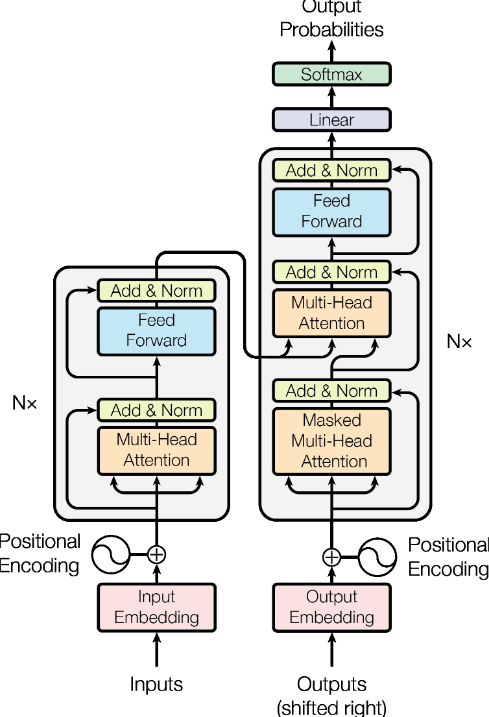

# pytorch-transformer

## Building the Transformer Model with PyTorch
## To build the Transformer model the following steps are necessary:

1. Importing the libraries and modules
2. Defining the basic building blocks - Multi-head Attention, Position-Wise Feed-Forward Networks, Positional Encoding
3. Building the Encoder block
4. Building the Decoder block
5. Combining the Encoder and Decoder layers to create the complete Transformer network

## TO-DO
[x] Self-attention
[x] Scaled-dot product attention
[x] Multi-head Attention
[x] Positional Encoding
[x] Position-wise Feed-Forward Networks
[] Layer normalization
[] Encoder
[] Decoder
[] Refactoring