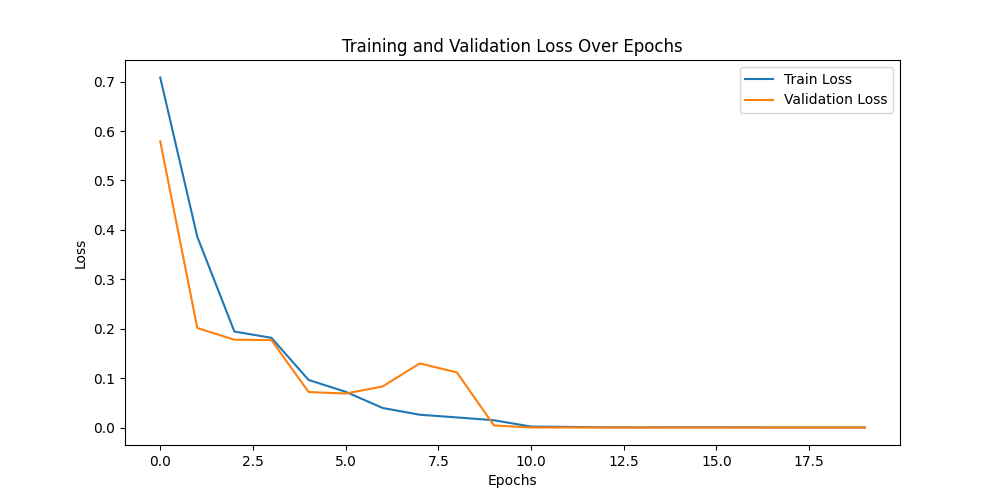

# Pytorch-Transformer Implementation
This repository contains an implementation of the [Transformer model (Attention is All You Need)](https://arxiv.org/abs/1706.03762) in PyTorch. The model is trained and tested on a dummy dataset consisting of tokens `<sos>=0`, `<eos>=1`, `<pad>=2`, and additional tokens 3 and 4, representing sequences. The core architecture is located in the `model/` directory. 


  
## Guide
Before you run the commands, modify the configurations in `data/config.yaml` as per your requirements.  
### Training
Run the following command to start training the model:
```
python main.py --output ${OUTPUT_PATH} --log ${LOG_PATH} --cfg ${CFG_PATH}
```

### Testing
Run the following command to start testing the model:
```
python test.py --model ${MODEL_PATH} --cfg ${CFG_PATH}
```
## Implementation
The main Transformer architecture is defined as follows. Other components like the Encoder and Decoder are implemented separately in the `model/` directory:
```
class Transformer(nn.Module):
    def __init__(self, enc_vsize, dec_vsize, d_model, max_len, dropout_p=0.1, n_heads=8, n_layers=6, d_ff=2048, device=None,
                 src_pad_idx=0, tgt_pad_idx=0):
        super(Transformer, self).__init__()
        self.device = device 

        self.encoder = Encoder(vocab_size=enc_vsize,
                               d_model=d_model,
                               max_len=max_len,
                               dropout_p=dropout_p,
                               n_heads=n_heads,
                               n_layers=n_layers,
                               d_ff=d_ff,
                               device=device)
        
        self.decoder = Decoder(vocab_size=dec_vsize,
                               d_model=d_model,
                               max_len = max_len,
                               dropout_p=dropout_p,
                               n_heads=n_heads,
                               n_layers=n_layers,
                               d_ff=d_ff,
                               device=device)
        self.src_pad_idx = src_pad_idx 
        self.tgt_pad_idx = tgt_pad_idx

    def make_src_mask(self, source) -> torch.Tensor:
        """Padding mask"""
        src_mask = (source != self.src_pad_idx).unsqueeze(1).unsqueeze(2) #  batch_size x seq_len -> batch_size x 1 x 1 x seq_len
        return src_mask 
    
    def make_target_mask(self, target) -> torch.Tensor:
        """
        1) padding mask - finds padding token and assigns False
        2) attention mask (target mask) - limits access available parts  
        """
        padding_mask = (target != self.tgt_pad_idx).unsqueeze(1).unsqueeze(3)
        target_seq_len = target.size(1)
        nopeak_mask = (1 - torch.triu(torch.ones(1, target_seq_len, target_seq_len), diagonal=1)).bool().to(self.device)
        target_mask = nopeak_mask & padding_mask
        
        return target_mask 
    
    def forward(self, src, tgt):
        src_mask = self.make_src_mask(src) # batch_size x 1 x 1 x src_seq_len
        tgt_mask = self.make_target_mask(tgt) # batch_size x 1 x 1 x tgt_seq_len

        enc_emb = self.encoder(src, src_mask) # batch_size x src_seq_len x d_model
        tgt_emb = self.decoder(enc_emb, tgt, src_mask, tgt_mask) # batch_size x tgt_seq_len x tgt_vocab_size
        return tgt_emb # No softmax as applied in CrossEntroyLoss

```

## Dataset
**Tokens**:  
- `SOS` token: `0`   
-  `EOS` token: `1`  
-  `PAD` token: `2` (not used in this function)  
-  `WORDS`: `3`, `4` (used to generate patterns)  
    
**Patterns**:   
- Sequence of all 3s: `[0, 3, 3, 3, 3, 3, 3, 3, 3, 1]`  
- Sequence of all 4s: `[0, 4, 4, 4, 4, 4, 4, 4, 4, 1]`  
- Alternating 3s and 4s starting with 3: `[0, 3, 4, 3, 4, 3, 4, 3, 4, 1]`  
- Alternating 3s and 4s starting with 4: `[0, 4, 3, 4, 3, 4, 3, 4, 3, 1]`  
      
## Results 
### Training
The below graph is about the model traind until 20 epochs and 5 warmup steps. You can download the trained model [here](https://drive.google.com/file/d/1R-JXH_cFMXFKrfejEqrBj36gUigDgIyX/view?usp=sharing).
  


### Inference    
``` 
Example 0
Input: [3, 3, 3, 3, 3, 3, 3, 3]
Continuation: [3, 3, 3, 3, 3, 3, 3, 3]

Example 1
Input: [4, 4, 4, 4, 4, 4, 4, 4]
Continuation: [4, 4, 4, 4, 4, 4, 4, 4]

Example 2
Input: [3, 4, 3, 4, 3, 4, 3, 4]
Continuation: [3, 4, 3, 4, 3, 4, 3, 4]

Example 3
Input: [4, 3, 4, 3, 4, 3, 4, 3]
Continuation: [3, 4, 3, 4, 3, 4, 3, 4]

Example 4
Input: [3, 4, 3]
Continuation: [3, 4, 3, 4, 3, 4, 3, 4]
```

## Configurations Structure

```
train:  
  batch_size:      
  epochs:    
  learning_rate: 
  d_model:   
  n_heads:  
  n_layers:   
  d_ff:  
  dropout_p: 
  max_len:   
  warmup_steps:   

test:
  d_model:
  n_heads: 
  n_layers:
  d_ff: 
  dropout_p: 
  max_len: 

```

## References 
- [Attention Is All You Need](https://arxiv.org/abs/1706.03762)
- [Transformer: PyTorch Implementation of "Attention Is All You Need"](https://github.com/hyunwoongko/transformer/tree/master)
- [A detailed guide to PyTorch’s nn.Transformer() module](https://towardsdatascience.com/a-detailed-guide-to-pytorchs-nn-transformer-module-c80afbc9ffb1)

## TO-DO
- [x] Add Encoder, Decoder
- [x] Training/Validation logic with dataset
- [x] Refactoring
- [x] Add other parts
    - [] label smoothing
    - [] Add BLEU & PPL (https://brunch.co.kr/@leadbreak/11)
